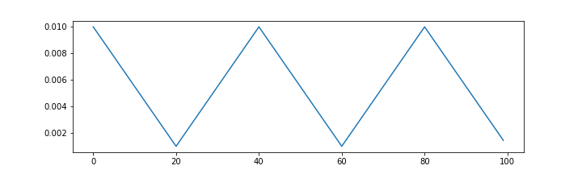

# pytorch-linear-cyclical-lr-scheduler
LinearCyclicalLR scheduler implemented by Pytorch

## Environment
- pyhton3.7
- pytorch1.0

## example
`LinearCyclicalLR(optimizer, T_down=20,T_up=20, eta_min=0.001)`

`LinearCyclicalLR(optimizer, T_down=40,T_up=20, eta_min=0.001)`

